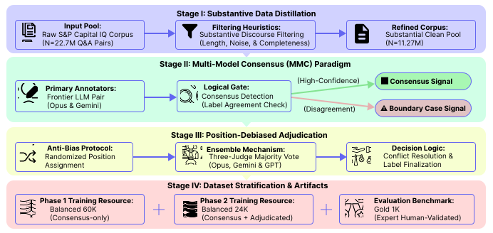
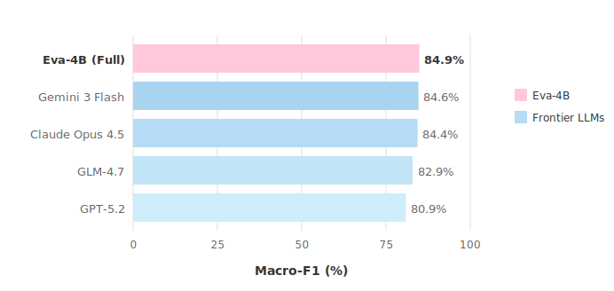

# EvasionBench

<p align="center">
  <a href="https://iiiiqiiii.github.io/EvasionBench"></a>
  <a href="https://huggingface.co/FutureMa/Eva-4B-V2"></a>
  <a href="https://huggingface.co/datasets/FutureMa/EvasionBench"></a>
  <a href="https://colab.research.google.com/github/IIIIQIIII/EvasionBench/blob/main/scripts/eva4b_inference.ipynb"></a>
  <a href="https://arxiv.org/abs/2602.xxxxx"></a>
  <a href="LICENSE"></a>
</p>

<p align="center">
  <b>A large-scale benchmark for detecting managerial evasion in earnings call Q&A.</b>
</p>

## Overview

EvasionBench introduces a three-level evasion taxonomy (**direct**, **intermediate**, **fully evasive**) and a Multi-Model Consensus (MMC) annotation framework using frontier LLMs. Our benchmark includes 84K balanced training samples and a 1K gold-standard evaluation set.

**Eva-4B**, a fine-tuned Qwen3-4B model, achieves **84.9% Macro-F1**, outperforming larger frontier models including Claude Opus 4.5 and GPT-5.2.

## Multi-Model Consensus (MMC) Framework

Our MMC framework leverages multiple frontier LLMs for annotation, with a three-judge majority voting mechanism to resolve disagreements.

<p align="center">
  
</p>

## Model Performance

Top 5 models on EvasionBench 1K evaluation set. **Eva-4B (Full)** achieves the highest Macro-F1, outperforming frontier LLMs.

<p align="center">
  
</p>

## Leaderboard

Full evaluation results on EvasionBench 1K gold-standard test set.

| Rank | Model | Category | Accuracy | Macro-F1 |
|------|-------|----------|----------|----------|
| 1 | **Eva-4B (Full)** | Eva-4B | 84.8% | **84.9%** |
| 2 | Gemini 3 Flash | Closed-Source | 84.6% | 84.64% |
| 3 | Claude Opus 4.5 | Closed-Source | 84.1% | 84.38% |
| 4 | GLM-4.7 | Open-Source | 83.1% | 82.91% |
| 5 | Eva-4B (Consensus) | Eva-4B | 81.0% | 81.37% |
| 6 | GPT-5.2 | Closed-Source | 80.8% | 80.90% |
| 7 | Eva-4B (Opus Only) | Eva-4B | 80.6% | 80.61% |
| 8 | Qwen3-Coder | Open-Source | 78.0% | 78.16% |
| 9 | MiniMax-M2.1 | Open-Source | 71.8% | 71.31% |
| 10 | DeepSeek-V3.2 | Open-Source | 66.7% | 66.88% |
| 11 | Kimi-K2 | Open-Source | 67.8% | 66.68% |
| 12 | Qwen3-4B (Base) | Base Model | 42.3% | 34.30% |

## Evasion Taxonomy

| Label | Definition | Example |
|-------|------------|---------|
| **Direct** | The core question is directly and explicitly answered | "We expect Q4 margin to be 32%." |
| **Intermediate** | The response provides related context but sidesteps the specific core | "We expect margins to improve relative to Q3." |
| **Fully Evasive** | The question is ignored, refused, or the response is entirely off-topic | "We are focused on driving long-term shareholder value." |

## Project Structure

```
EvasionBench/
├── index.html          # Project page
├── README.md           # This file
├── LICENSE             # Apache 2.0
├── assets/             # Charts and figures
├── data/               # EvasionBench data samples
├── prompts/            # Prompt templates
└── scripts/            # Inference scripts
    ├── eva4b_inference.py      # Command-line inference
    └── eva4b_inference.ipynb   # Colab notebook
```

## Links

- [Project Page](https://iiiiqiiii.github.io/EvasionBench)
- [Model on HuggingFace](https://huggingface.co/FutureMa/Eva-4B-V2)
- [Dataset on HuggingFace](https://huggingface.co/datasets/FutureMa/EvasionBench)
- [Paper (arXiv)](https://arxiv.org/abs/2602.xxxxx)

## Citation

```bibtex
@article{evasionbench2026,
  title={EvasionBench: A Large-Scale Benchmark for Detecting Managerial Evasion in Earnings Call Q&A},
  author={...},
  journal={arXiv preprint arXiv:2602.xxxxx},
  year={2026}
}
```

## License

Apache 2.0
